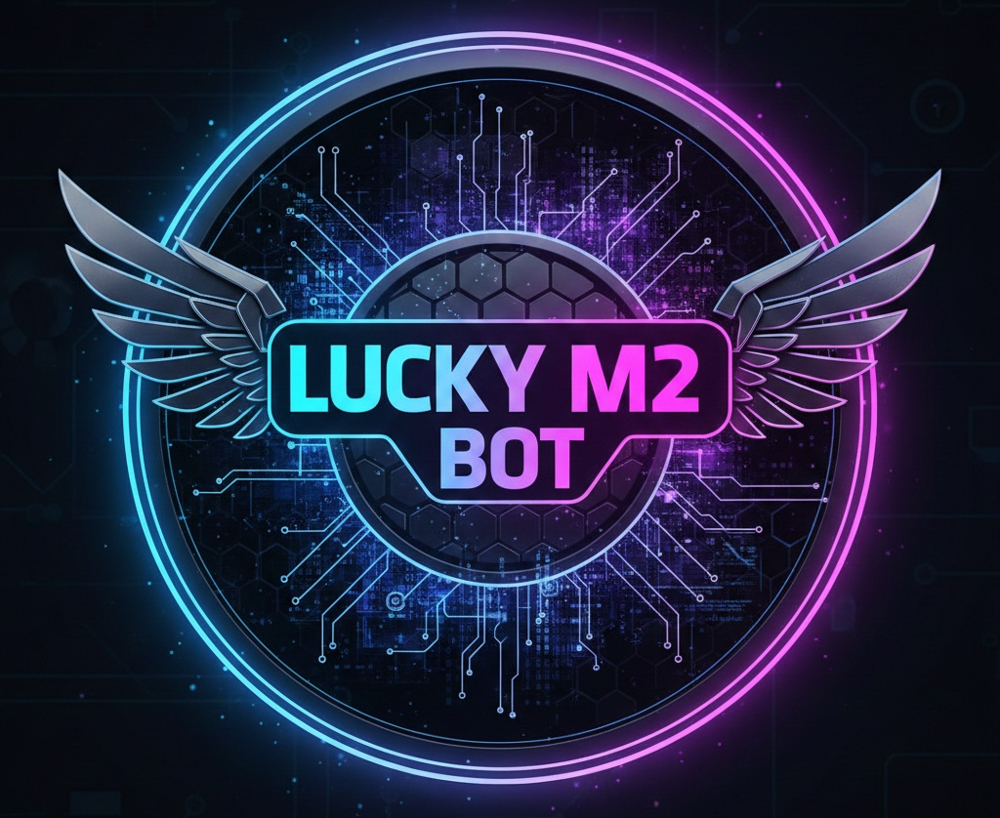

<div align="center">

# 🚀 LUCKY M2 BOT

[](https://github.com/WhiskeySockets/Baileys)
[](https://nodejs.org/)
[](LICENSE)



**A high-performance WhatsApp Multi-Device bot powered by Baileys.**
Fast. Lightweight. Modular. Production-ready.

</div>

---

## 📌 Overview

**Lucky M2 Bot** is a WhatsApp MD bot built using the WhiskeySockets **Baileys** library. It is engineered for:

* ⚡ High performance
* 🧠 Clean modular structure
* 🔧 Easy customization
* 🛡 Stable session handling
* 🌍 Flexible deployment (VPS, panels, cloud platforms)

This project is **fully open source**. You are free to fork, modify, rebrand, and deploy your own version — no permission required.

---

# ✨ Core Features

### 🔓 Fully Open Source

* Complete access to the source code
* Host anywhere (VPS, panels, cloud platforms)
* No hidden restrictions

### 🧩 Modular Command System

* Organized `commands/` directory
* Easily add, remove, or edit features
* Clean separation of logic

### ⚙️ Advanced Customization

* Change bot name
* Modify prefix
* Update bot image
* Configure channel/newsletter
* Adjust settings via commands or config

### 🚀 Optimized Performance

* Efficient session handling (`sessionID` support)
* RAM-optimized media streaming
* Temporary file cleanup
* Crash-resistant structure

### 👑 Owner Utilities

* Restart command
* Update from ZIP
* Admin-only tools
* Maintenance controls

---

# 📦 Installation Guide

---

## 1️⃣ Fork the Repository

<div align="center">

<a href="https://github.com/Tomilucky218/Lucky-M2-Bot/fork" target="_blank">
  
</a>

</div>

This creates your own copy under your GitHub account.

---

## 2️⃣ Generate Pair Code (Session String)

Deploy the helper service to generate your WhatsApp session string.

<div align="center">

<a href="https://lucky-tech-hub-bot-pair-code-1.onrender.com/" target="_blank">
  
</a>

</div>

After pairing, you’ll receive a session string like:

```
LuckyM2-H4....
```

Add it to your `config.js`:

```js
sessionID: 'LuckyM2-H4....'
```
---

## 🛠 Local Development Setup

### Step 1: Clone Repository

```bash
git clone https://github.com/Tomilucky218/Lucky-M2-Bot.git
cd Lucky-M2-Bot
```

### Step 2: Install Dependencies

```bash
npm install
```

### Step 3: Configure Session

Edit `config.js`:

**Use Session String**

```js
sessionID: 'LuckyM2-H4....'
```

### Step 4: Start the Bot

```bash
node index.js
```

---

# 🌍 Deployment Options

You can deploy Lucky M2 Bot on:

* VPS (Ubuntu/Debian recommended)
* Hosting panels (Katabump, Pterodactyl, etc.)
* Cloud platforms
* Self-hosted servers

### Example Panel Deployment

<div align="center">

<a href="https://dashboard.katabump.com/auth/login#d6b7d6" target="_blank">
  
</a>

<a href="https://bot-hosting.net/?aff=1384907250438770829" target="_blank">
  
</a>
</div>


### 📺 Video Tutorial

<div align="center">
  <a href="https://youtu.be/4PQcn-qqrcE">
    
  </a>
</div>

---

# 🤝 Community

Stay connected and receive updates:

<div align="center">

<a href="https://t.me/luckytechhub" target="_blank">
  
</a>

<a href="https://whatsapp.com/channel/0029VbAnuvT6RGJ9Qrf3NJ0L" target="_blank">
  
</a>

</div>

---

# 🙏 Credits

* **Lucky 218** – Founder & Lead Developer
* WhiskeySockets – Maintainers of `@whiskeysockets/baileys`
* Open-source contributors listed in `package.json`

---

Your support helps maintain and improve this open-source project.

---

# ⚠️ Disclaimer

* This project is for **educational purposes only**.
* This is **NOT** an official WhatsApp product.
* Use of third-party bots may violate WhatsApp's Terms of Service.
* Accounts may be banned if misused.

> You are solely responsible for how you use this software.

---

# 📜 Legal Notice

* This project is **not affiliated with, endorsed by, or associated with WhatsApp Inc.**
* Do **NOT** use this bot for:

  * Spam
  * Bulk unsolicited messaging
  * Harassment
  * Illegal activities

The developer assumes **no liability** for misuse or damages.

---

# 📄 License

This project is licensed under the **MIT License**.

You must:

* Retain original copyright
* Include license notice
* Follow all applicable laws
* Credit original authors

---

<div align="center">

### ⭐ If you like this project, consider starring the repository!

</div>
